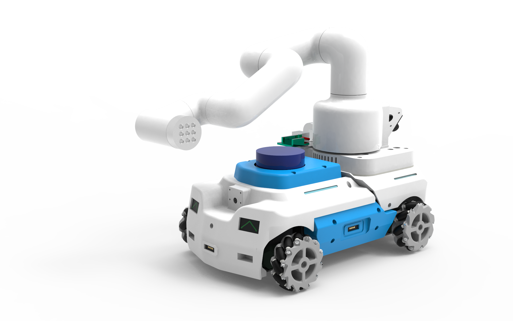
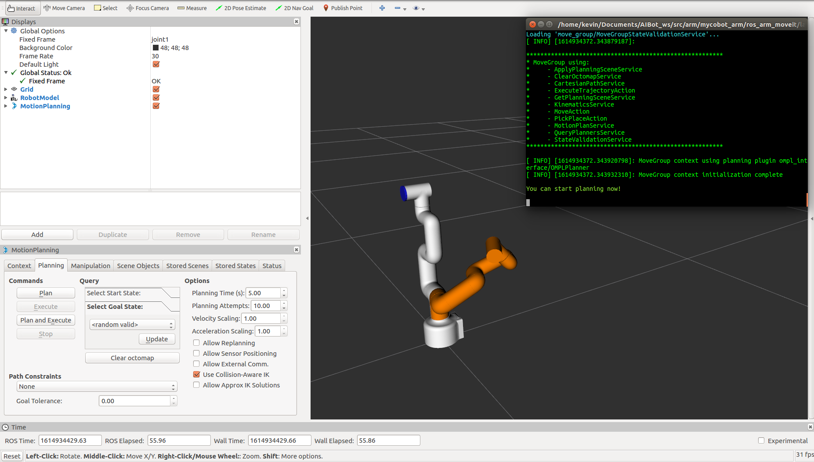

# AIBot 小车 & mycobot 机械臂ros moveit控制



这是针对AIBot小车的机械臂开发的ROS控制器，他实现了机械臂通过ROS Moveit进行控制。

## 机械臂固件版本

* Basic : Transponder
* Atom : AtomMain

## 系统及ROS版本

* ubuntu16.04
* rosdistro : kinetic
* rosversion : 1.12.14


## 安装依赖包

```cmd
sudo apt-get install ros-kinetic-joint-state-controller 
sudo apt-get install ros-kinetic-joint-trajectory-controller 
sudo apt-get install ros-kinetic-controller-manager
sudo apt-get install ros-kinetic-position-controllers
sudo apt-get install ros-kinetic-serial
```
## 另外您还需要下载两个包，包括一个消息包以及 MyCobo moveit配置包

下载小车消息依赖包
* [aibot_msgs](https://github.com/xmhuaway/aibot_msgs.git)

```cmd
git clone https://github.com/xmhuaway/aibot_msgs.git
```

下载机械Moveit 配置文件包
* [mycobot_moveit_config](https://github.com/xmhuaway/mycobot_moveit_config)

```cmd
git clone https://github.com/xmhuaway/mycobot_moveit_config
```

## 运行

```cmd
roslaunch ros_arm_moveit mycobot_arm_moveit.launch
```


